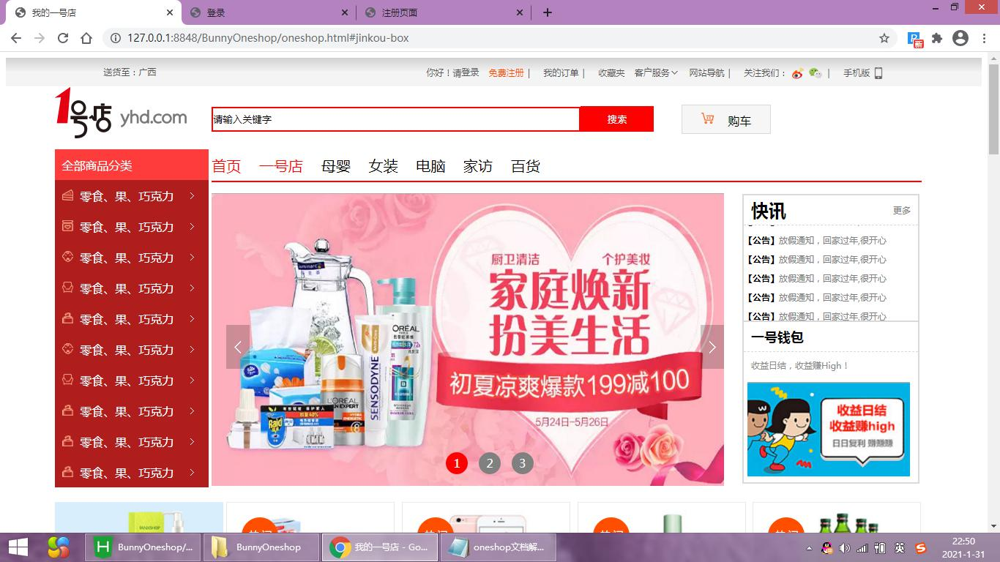
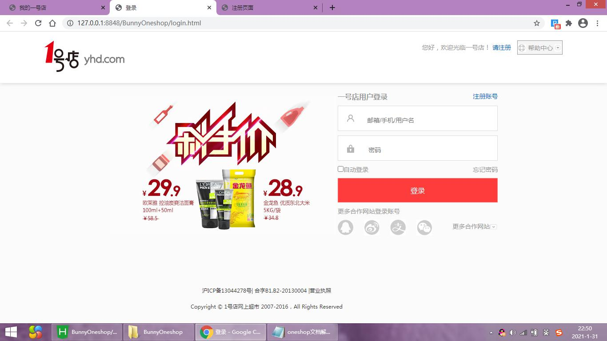
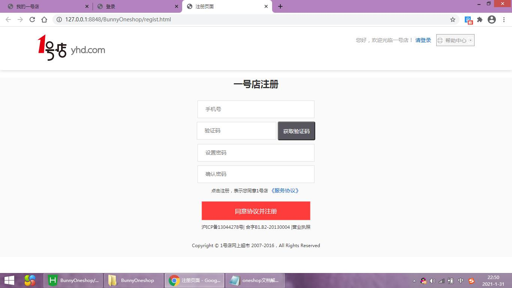

oneshop静态页面设计(商城首页、登录页、注册页)

解析：
整体局部包括四大部分：头部区域、菜单搜索/导航区域、内容区域、底部区域

HTML:

使用div 布局页面
	head头部
	search-logo搜索
	all-good-type-box全部分类
	main-box标题内容导航
	banner-box横幅图片
	kuaixun快讯
	host-sell热卖产品
	ban-box广告位
	jinkou-box进口生鲜/个人美妆/母婴
	true-box正品保障/满50包邮/今日特价/准时送达
	foot-nav-box底部导航 
	foot-box底部
	... ...

CSS效果：

1.去除所有所有的标签的内边距，外边距
2.头部：高、行高、背景渐变色、内边距、字体大小、颜色等；头部右边的span ,img  垂直居中等
3.对无序列表，有序列表，做一个整体样式 ，去除列表样式
4.超链接默认样式：字体颜色、去除字体下划线，鼠标悬停，字体颜色：#FF4E00
5.inline-block内联块：上下两个div 变成左右的 (div 变成行内块的标签)
6.搜索输入框：边框颜色、宽度、高度等；搜索按钮：字体颜色、背景颜色、边框颜色、宽度、高度等
7.最近搜索：字体的颜色、去除文字的下划线...
8.全部分类：去除无序列表的黑点；设置宽、高、行高、字体大小、边距（左、上）、padding-left: 10px;/* 防止二级菜单，被标签标签覆盖 */
9.分类前面的图片的样式、分类的箭头图片：....
10.为子标签进行绝对定位
11.隐藏二级菜单:需要根据父级盒子，进行绝对定位;设置距离:250px
12.当鼠标放置分类上，显示二级菜单: 父类的标签,必须是定位position 
13.将全部分类，轮播，快讯 变成左右放置:轮播图片的下标样式、鼠标放在下标上的样式
14.轮播图的盒子，进行相对定位 ；下标的盒子进行绝对定位；轮播图，左（右）边切换的图片
15.轮播图上面的分类：详情如图所示
16:热卖产品放大：hover --》transform: scale(1.1,1.1);
17.动画：#true-box ul li img{
	/* 动画时间 */
	transition: all 0.5s;}
	#true-box ul li img:hover{
	/* 旋转360度，方法1.2 倍 */
	transform: rotate(360deg) scale(1.2);}
... ...

成果展示：

